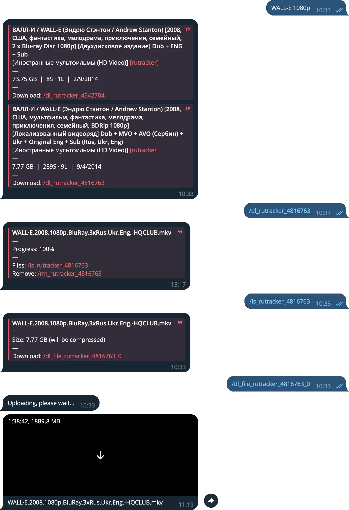

<h1 align="center">Media Assistant Bot</h1>

<p align="center">

</p>

## About

This is the sources of a Telegram `Bot` is designed to help you search for torrents and remotely download them to your PC using the qBittorrent client. Once the torrent is downloaded, you can ask the `Bot` to send you any file from the torrent and download it from any other device.

## Disclaimer

This `Bot` is created for a personal usage, so it might have some bugs or not work perfectly. If you have any questions, issues or improvements, feel free to open an issue ticket or submit a pull request.

This `Bot` will not help you overcome the restrictions associated with blocking torrent trackers, since it runs locally on your PC.

<!-- test commit for husky pre-commit hook -->

## Before You Get Started

1. **Create a New Bot on Telegram:**
   - Open the Telegram and search for the `BotFather` bot.
   - Start a chat with `BotFather` and send the command `/newbot`.
   - Follow the prompts to name your bot and create a unique username for it.
   - Once done, `BotFather` will provide you with a `TOKEN`. Keep this token safe as you'll need it later.

2. **Obtain `API_ID` and `API_HASH`**
   - Obtain `API_ID` and `API_HASH` as described in https://core.telegram.org/api/obtaining_api_id. It will be used to run a local `API Server` to allow the `Bot` to send large files.

3. **Register on Rutracker:**
   - Go to the Rutracker website and create an account if you don't already have one.
   - Note down your Rutracker `USERNAME` and `PASSWORD`. These credentials will be used by the bot to login and perform searches.

## Setup

Open your terminal and run the following command:

```bash
tmpfile=$(mktemp) && curl -fsSL https://raw.githubusercontent.com/strayiker/smart-home-media-assistant-telegram-bot/refs/heads/main/scripts/install-linux.sh -o $tmpfile && chmod +x $tmpfile && bash $tmpfile && rm $tmpfile
```

It will ask you for some necessary information, so don't go too far.

## Update

To update the `Bot` to the latest version, run the following command in the folder where your `Bot` is installed:

```bash
./update.sh
```

<!-- removed test markers -->
