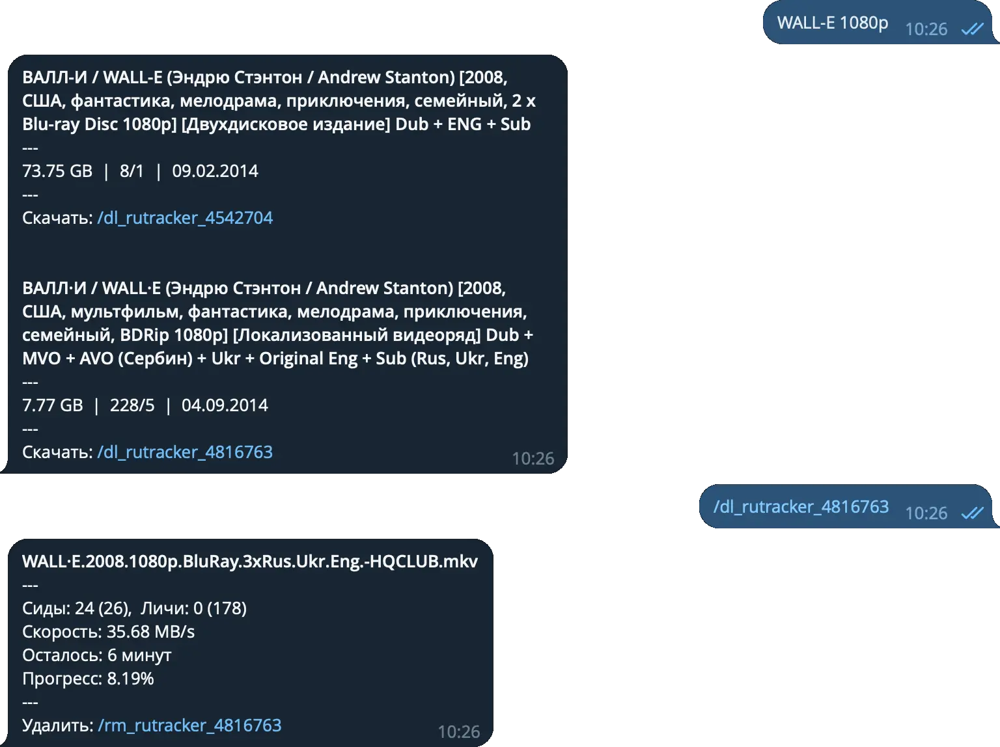

# Smart Home Media Assistant Telegram Bot

Hey there! This is the sources of a Telegram bot is designed to help you search for torrents and remotely download them to your PC using the qBittorrent client. It's written in TypeScript and runs in a Docker container on your PC.

<p align="center">

</p>

## Disclaimer

This bot is created for a personal usage, so it might have some bugs or not work perfectly. However, I hope you find it useful. If you have any improvements or want to add support for other torrent trackers, feel free to submit a pull request.

If you find this bot helpful, a star would be greatly appreciated!

## Before You Get Started

1. **Create a New Bot on Telegram:**

   - Open the Telegram and search for the "BotFather" bot.
   - Start a chat with BotFather and send the command `/newbot`.
   - Follow the prompts to name your bot and create a unique username for it.
   - Once done, BotFather will provide you with a `token`. Keep this token safe as you'll need it later.

2. **Register on Rutracker:**

   - Go to the Rutracker website and create an account if you don't already have one.
   - Note down your Rutracker `username` and `password`. These credentials will be used by the bot to login and perform searches.

## Semi-Automatic Installation

Open your terminal and run the following command:

```bash
tmpfile=$(mktemp) && curl -sSL https://raw.githubusercontent.com/strayiker/smart-home-media-assistant-telegram-bot/refs/heads/main/scripts/setup.sh -o $tmpfile && chmod +x $tmpfile && bash -i $tmpfile && rm $tmpfile
```

**This script will perform the following tasks:**

1.  Check for a container tools. If none is found, it installs `Podman` (fast and light open source container tool).
2.  Install `qBittorrent` if it's not already installed.
3.  Configure qBittorrent `WebUI`.
4.  Configure environment and the bot.
5.  Create scripts to **start**, **stop**, and **update** the bot.
6.  Run the `qBittorrent` and the bot for you.

Throughout the setup process, the script will interact with you, asking for the necessary information to configure the software and the bot itself.

## Manual Installation

### Prerequisites

**The following software is required to be installed on your PC:**

1. Git.
1. Docker (or Podman, or any other container tool you prefer).
1. qBittorrent.

**For Windows Users:**

Additionally, make sure you have `Make` for Windows. You can download it from [GnuWin](https://gnuwin32.sourceforge.net/packages/make.htm), or install it using `winget:`

```bash
winget install -e --id GnuWin32.Make
```

### Step-by-Step

1. **Configure qBittorrent Web-UI:**

   - Open the qBittorrent client on your PC.
   - Go to `Options` > `Web UI`.
   - Enable the Web UI and set a username (default is `admin`) and password.
   - Set the port (default is `8080`).
   - Make sure the Web UI is accessible from your local network (open [http://localhost:8080](http://localhost:8080) in your web browser).

2. **Clone the Repository:**

   - Open your terminal and run the following commands:
     ```bash
     git clone https://github.com/strayiker/smart-home-media-assistant-telegram-bot.git
     cd smart-home-media-assistant-telegram-bot
     ```

3. **Set Up Environment Variables:**

   - In the cloned repository, you'll find a file named `.env.template`.
   - Rename this file to `.env` and open it in a text editor.
   - Replace the placeholders with your values.

4. **Build the Docker Image:**

   - Run the following command to build the Docker container:
     ```bash
     make build
     ```
   - If you prefer some other tool instead of Docker, you can use the `use` option, for example:
     ```bash
     make build use=podman
     ```

5. **Start the Docker Container:**

   - To start the bot, run:
     ```bash
     make run
     ```

6. **Inspect the logs of Docker Container:**

   - To start the bot, run:
     ```bash
     make logs
     ```

7. **Stop and Clean Up:**

   - When you're done, you can stop the Docker container by running:
     ```bash
     make stop
     ```

8. **Updating the Bot**

   - Pull the updates from the repository
     ```bash
     git pull
     ```
   - Stop, rebuild, and start the bot
     ```bash
     make stop build run logs
     ```

## Interacting with the Bot

1. Open Telegram and start a chat with your bot.
2. Send a message to the bot to search for torrents. For example, you can type `Wall-E 1080p`.
3. The bot will respond with search results, each containing a link to download the torrent.
4. Click on the link, and the bot will add the torrent to the qBittorrent client running on your PC.
5. The bot will provide you with the download stats and periodically update them.
